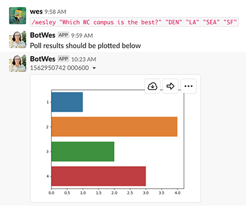

# Poll Patrol - A Proof of Concept
Author: wes - la - july 2019
___

## The Problem
Simply put: Simple Poll sucks for our use case. Students are able to see peers' answers before they submit their own. In order to get accurate knowledge checks, the poll should not reveal the distribution of answers until AFTER students are finished voting. Example of our current poll system:

  

I can see how others have voted before casting my own vote. This is bad. So what do we do? Its not like we could just build our own slack bot with custom slash commands to handle this, right? RIGHT?
 

## A Potential Solution

_We maintain our own slack bot with a custom slash command to handle this. I have a prototype up and running on a private slack org._

**The slash command:**  

Intended to work like `/poll` to minimize invasiveness. Invoked with `/wesley` followed by `"question"` and then `"answer1" "answer2" ...` 

*Example:* `/wesley "Who is the greatest local instructor ever?" "Wesley Bosse" "Wesley Bosse wearing a cowboy hat" "Steven Bonferoni (Wesley Bosse wearing full disguise)"`

*Results in the following poll:*

 
   

**Voting:**

Students vote on the poll like normal. A pop-up message provides the students with confirmation that their vote is being counted, but the poll itself is not modified to display current answers. 

 
 

**Releasing Results:**

Once the instructor is satisfied with the amount of votes received (still working on a way to track this) they can select the "release results" button. This generates a horizontal bar plot to show the answer counts. In the following example, there were 3 votes for answer1, 6 votes for answer2, and 4 votes for answer3 which resulted in this graphic:

 
 

**Moving Forward:**
While the core process is currently working, there are a few things that would need to be finished before actually using this:
- Improve the graph quality with labels, better coloring, etc.
- Give poll creator a count of answers received.
- Clean up the disgusting code that powers all of this currently. Seriously, its bad. 