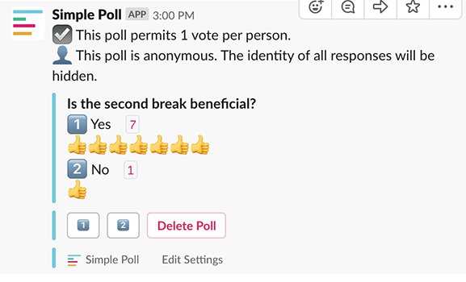

# Poll Patrol - A Proof of Concept
Author: wes - la - july 2019
___

## The Problem
Simple Poll isn't the perfect solution for our polling needs. Students are able to see what their classmates have answered before submitting their own response. We need a poll that doesn't reveal the distribution of answers until _after_ students are finished voting in order to get accurate knowledge checks. Example of our current poll system:

  

I can see how others have voted before casting my own vote.
 

## A Potential Solution

_We maintain our own slack bot with a custom slash command to handle this. A prototype is up and running on a private slack org._

**The slash command:**  

Intended to work like `/poll` to minimize invasiveness. For my test installation, it is invoked with `/trupoll` followed by `"question"` and then `"answer1" "answer2" ...` 

*Example:* `/trupoll "Which WC campus is the best?" "DEN" "LA" "SEA" "SF"`

*Results in the following poll (example shown uses outdated slash command):*

 
   

**Voting:**

Students vote on the poll like normal. A pop-up message provides the students with confirmation that their vote is being counted, but the poll itself is not modified to display current answers. 

 
 

**Releasing Results:**

Once the instructor is satisfied with the amount of votes received (still working on a way to track this) they can select the "release results" button. This generates a horizontal bar plot to show the answer counts and deletes the poll from the chat log. I added 9 fake votes (on top of my 1 sample vote for LA) to the DB to produce the following results:

 
 

**Moving Forward:**  
While the core process is currently working, there are a few things that would need to be finished before actually using this:
- Improve the plot quality with labels, better coloring, etc.
- Give poll creator a count of answers received in an ephemeral message.
- Implement restrictions on who can release results.
- Automate the database cleanup
