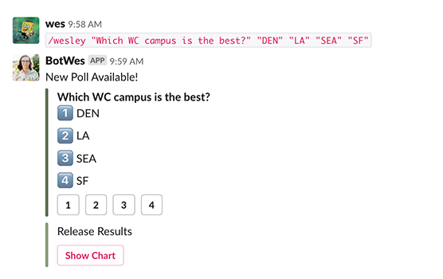
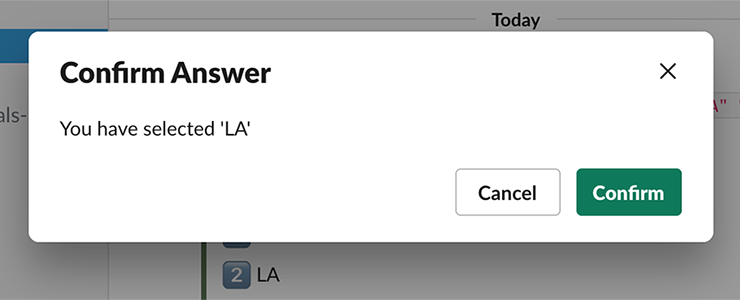

# Poll Patrol - A Proof of Concept
Author: wes - la - july 2019
___

## The Problem
Simple Poll doesn't work for our use case. Students are able to see what other students are answering before they submit their own. In order to get accurate knowledge checks, we need a poll that doesn't reveal the distribution of answers until _after_ students are finished voting. Example of our current poll system:

  

I can see how others have voted before casting my own vote.
 

## A Potential Solution

_We maintain our own slack bot with a custom slash command to handle this. I have a prototype up and running on a private slack org._

**The slash command:**  

Intended to work like `/poll` to minimize invasiveness. For my test installation, it is invoked with `/wesley` followed by `"question"` and then `"answer1" "answer2" ...` 

*Example:* `/wesley "Which campus is the best?" "ATL" "ATX" "BOS" "CHI" "DC" "DEN" "LA" "NYC" "SEA" "SF"`

*Results in the following poll:*

 
   

**Voting:**

Students vote on the poll like normal. A pop-up message provides the students with confirmation that their vote is being counted, but the poll itself is not modified to display current answers. 

 
 

**Releasing Results:**

Once the instructor is satisfied with the amount of votes received (still working on a way to track this) they can select the "release results" button. This generates a horizontal bar plot to show the answer counts and deletes the poll from the chat log. I added 25 fake votes to the DB to produce the following results:

 
 

**Moving Forward:**  
While the core process is currently working, there are a few things that would need to be finished before actually using this:
- Improve the plot quality with labels, better coloring, etc.
- Give poll creator a count of answers received in an ephemeral message.
- Implement restrictions on who can release results.
- Automate the database cleanup
- Further clean up the disgusting code that powers all of this currently. Seriously, its bad. 